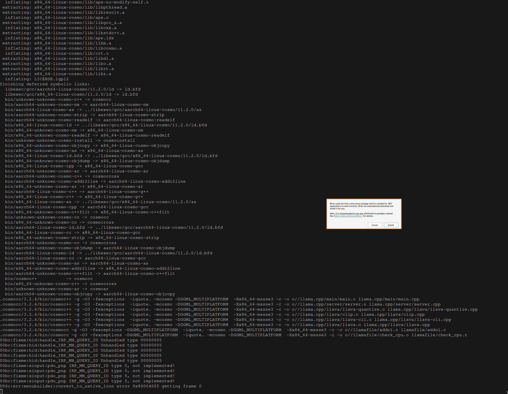

# Why this fork?

This fork of [llamafile](https://github.com/Mozilla-Ocho/llamafile) is for building llamafiles for memory cache.

There's no real reason yet to have forked the project, but I will be ready to contibute patches upstream if I come up with any.

# Memory Cache

[Memory Cache](https://github.com/Mozilla-Ocho/Memory-Cache) is a project that allows you to save a webpage while you're browsing in Firefox as a PDF, and save it to a synchronized folder that can be used in conjunction with privateGPT to augment a local language model.

My goal is to wrap the backend in a llamafile, and serve a browser front-end using llamafile's embedded http client.

# Dev Log

## Dependencies

> Developing on llamafile requires a modern version of the GNU `make` command

```sh
➜ make --version
GNU Make 4.4.1
Built for x86_64-pc-linux-gnu
Copyright (C) 1988-2023 Free Software Foundation, Inc.
License GPLv3+: GNU GPL version 3 or later <https://gnu.org/licenses/gpl.html>
This is free software: you are free to change and redistribute it.
There is NO WARRANTY, to the extent permitted by law.
```

> `sha256sum`

```sh
➜ sha256sum --version
sha256sum (GNU coreutils) 9.4
Copyright (C) 2023 Free Software Foundation, Inc.
License GPLv3+: GNU GPL version 3 or later <https://gnu.org/licenses/gpl.html>.
This is free software: you are free to change and redistribute it.
There is NO WARRANTY, to the extent permitted by law.

Written by Ulrich Drepper, Scott Miller, and David Madore.
```

> `wget`

```sh
➜ wget --version
GNU Wget 1.21.4 built on linux-gnu.

-cares +digest -gpgme +https +ipv6 +iri +large-file -metalink +nls
+ntlm +opie +psl +ssl/gnutls

Wgetrc:
    /etc/wgetrc (system)
Locale:
    /usr/share/locale
Compile:
    gcc -DHAVE_CONFIG_H -DSYSTEM_WGETRC="/etc/wgetrc"
    -DLOCALEDIR="/usr/share/locale" -I. -I../lib -I../lib
    -I/usr/include/p11-kit-1 -DHAVE_LIBGNUTLS -DNDEBUG -march=x86-64
    -mtune=generic -O2 -pipe -fno-plt -fexceptions
    -Wp,-D_FORTIFY_SOURCE=2 -Wformat -Werror=format-security
    -fstack-clash-protection -fcf-protection -g
    -ffile-prefix-map=/build/wget/src=/usr/src/debug/wget -flto=auto
Link:
    gcc -I/usr/include/p11-kit-1 -DHAVE_LIBGNUTLS -DNDEBUG
    -march=x86-64 -mtune=generic -O2 -pipe -fno-plt -fexceptions
    -Wp,-D_FORTIFY_SOURCE=2 -Wformat -Werror=format-security
    -fstack-clash-protection -fcf-protection -g
    -ffile-prefix-map=/build/wget/src=/usr/src/debug/wget -flto=auto
    -Wl,-O1,--sort-common,--as-needed,-z,relro,-z,now -flto=auto
    -lpcre2-8 -luuid -lidn2 -lnettle -lgnutls -lz -lpsl ../lib/libgnu.a
    /usr/lib/libunistring.so

Copyright (C) 2015 Free Software Foundation, Inc.
License GPLv3+: GNU GPL version 3 or later
<http://www.gnu.org/licenses/gpl.html>.
This is free software: you are free to change and redistribute it.
There is NO WARRANTY, to the extent permitted by law.

Originally written by Hrvoje Niksic <hniksic@xemacs.org>.
Please send bug reports and questions to <bug-wget@gnu.org>.
```

> `unzip`

```sh
➜ unzip --version
caution:  both -n and -o specified; ignoring -o
UnZip 6.00 of 20 April 2009, by Info-ZIP.  Maintained by C. Spieler.  Send
bug reports using http://www.info-zip.org/zip-bug.html; see README for details.

Usage: unzip [-Z] [-opts[modifiers]] file[.zip] [list] [-x xlist] [-d exdir]
  Default action is to extract files in list, except those in xlist, to exdir;
  file[.zip] may be a wildcard.  -Z => ZipInfo mode ("unzip -Z" for usage).

  -p  extract files to pipe, no messages     -l  list files (short format)
  -f  freshen existing files, create none    -t  test compressed archive data
  -u  update files, create if necessary      -z  display archive comment only
  -v  list verbosely/show version info       -T  timestamp archive to latest
  -x  exclude files that follow (in xlist)   -d  extract files into exdir
modifiers:
  -n  never overwrite existing files         -q  quiet mode (-qq => quieter)
  -o  overwrite files WITHOUT prompting      -a  auto-convert any text files
  -j  junk paths (do not make directories)   -aa treat ALL files as text
  -U  use escapes for all non-ASCII Unicode  -UU ignore any Unicode fields
  -C  match filenames case-insensitively     -L  make (some) names lowercase
  -X  restore UID/GID info                   -V  retain VMS version numbers
  -K  keep setuid/setgid/tacky permissions   -M  pipe through "more" pager
  -O CHARSET  specify a character encoding for DOS, Windows and OS/2 archives
  -I CHARSET  specify a character encoding for UNIX and other archives

See "unzip -hh" or unzip.txt for more help.  Examples:
  unzip data1 -x joe   => extract all files except joe from zipfile data1.zip
  unzip -p foo | more  => send contents of foo.zip via pipe into program more
  unzip -fo foo ReadMe => quietly replace existing ReadMe if archive file newer
```

## Building from source

> `make -j8`

To my surprise, this command started a wine prompt. Why? What is it doing?



The README.md mentions WINE in the gotchas section:

> On some Linux systems, you might get errors relating to `run-detectors`
> or WINE. This is due to `binfmt_misc` registrations. You can fix that by
> adding an additional registration for the APE file format llamafile
> uses:
>
> ```sh
> sudo wget -O /usr/bin/ape https://cosmo.zip/pub/cosmos/bin/ape-$(uname -m).elf
> sudo chmod +x /usr/bin/ape
> sudo sh -c "echo ':APE:M::MZqFpD::/usr/bin/ape:' >/proc/sys/fs/binfmt_misc/register"
> sudo sh -c "echo ':APE-jart:M::jartsr::/usr/bin/ape:' >/proc/sys/fs/binfmt_misc/register"
> ```

I didn't know about `binfmt_misc` before, so I learned about it:

> binfmt_misc is a flexible and powerful feature of the Linux kernel that allows the kernel to recognize and execute files with arbitrary binary formats. It stands for "binary format miscellaneous," and it's particularly useful for running executable files that are not native to the system's architecture or for which there isn't a direct execution mechanism available in the kernel. Here's more detail on its origins, usage, and management:
> Origin
>
>     binfmt_misc was introduced to extend the kernel's ability to handle different binary formats beyond the native formats it supports (like ELF for Linux).
>     It is part of the Linux kernel and has been available since around the 2.1.43 version (mid-1997), providing a way to add support for non-native executable formats.
>
> Interacting with binfmt_misc
>
>     binfmt_misc is typically mounted as a filesystem under /proc/sys/fs/binfmt_misc, allowing user-space interaction.
>     You interact with it by reading from or writing to special files in this directory.
>     Each registered binary format has a corresponding file in this directory.
>
> Inspecting binfmt_misc
>
>     To see which binary formats are currently registered, you can simply list the contents of /proc/sys/fs/binfmt_misc. For example, using ls /proc/sys/fs/binfmt_misc or cat /proc/sys/fs/binfmt_misc/status.
>     Each entry in this directory (other than status and register) represents a registered binary format.
>
> Modifying binfmt_misc
>
>     To register a new binary format, you write a configuration string to the register file in the /proc/sys/fs/binfmt_misc directory.
>     The configuration string typically includes a magic number (to identify the file type), mask, and the interpreter to use.
>     For example, the commands you mentioned in your query are registering a new format for handling APE files by specifying how these should be recognized and processed.
>     To unregister a format, you can write to the specific file corresponding to that format in the /proc/sys/fs/binfmt_misc directory.

I am on x86_64 hardware:

```sh
➜ uname -m
x86_64
```

So the suggested commands will download the `ape` executable from `cosmo.zip` and register it as the thing that the linux kernel uses as the interpreter for the binary file format.

Let's download and run this executable. What could go wrong?

```sh
➜ ape --help
NAME

  actually portable executable loader version 1.10
  copyrights 2024 justine alexandra roberts tunney
  https://justine.lol/ape.html

USAGE

  ape   PROG [ARGV1,ARGV2,...]
  ape - PROG [ARGV0,ARGV1,...]

```

```sh
➜ ls /proc/sys/fs/binfmt_misc
APE  APE-jart  DOSWin  register  status

➜ bat /proc/sys/fs/binfmt_misc/APE*
───────┬────────────────────────────────────────────────────────────────────────────────────────────────────────────────────────────────
       │ File: /proc/sys/fs/binfmt_misc/APE
───────┼────────────────────────────────────────────────────────────────────────────────────────────────────────────────────────────────
   1   │ enabled
   2   │ interpreter /usr/bin/ape
   3   │ flags:
   4   │ offset 0
   5   │ magic 4d5a71467044
───────┴────────────────────────────────────────────────────────────────────────────────────────────────────────────────────────────────
───────┬────────────────────────────────────────────────────────────────────────────────────────────────────────────────────────────────
       │ File: /proc/sys/fs/binfmt_misc/APE-jart
───────┼────────────────────────────────────────────────────────────────────────────────────────────────────────────────────────────────
   1   │ enabled
   2   │ interpreter /usr/bin/ape
   3   │ flags:
   4   │ offset 0
   5   │ magic 6a6172747372
───────┴────────────────────────────────────────────────────────────────────────────────────────────────────────────────────────────────
```

# ROCm

The `make -j8` command still fails for me. (I saved the output to a file in this directory: `build.log`).

It seems to be complaining about `nvcc` missing. But I don't think I should have `nvcc` installed, because I don't have an NVIDIA GPU. Maybe I need `ROCm` installed on my system.

The README mentions:

> AMD GPU owners need to install the ROCm SDK. If llamafile detects the presence of an SDK, then it'll compile a native module just for your system that uses either the cuBLAS or hipBLAS library.

On archlinux, it appears that there are some [repositories](https://github.com/rocm-arch/rocm-arch) set up for doing just that. So I'll just `pacman -S rocm-hip-sdk` and try again.
