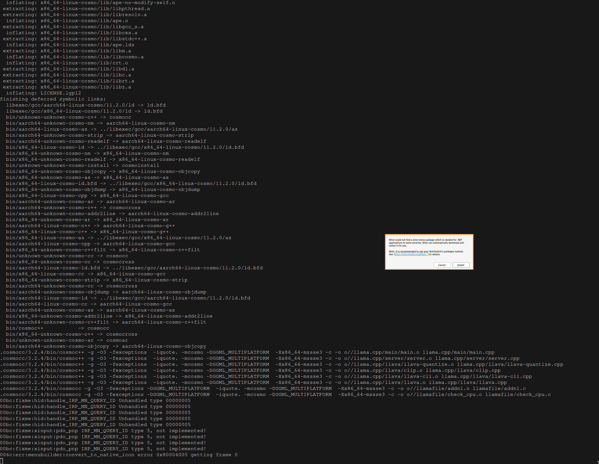
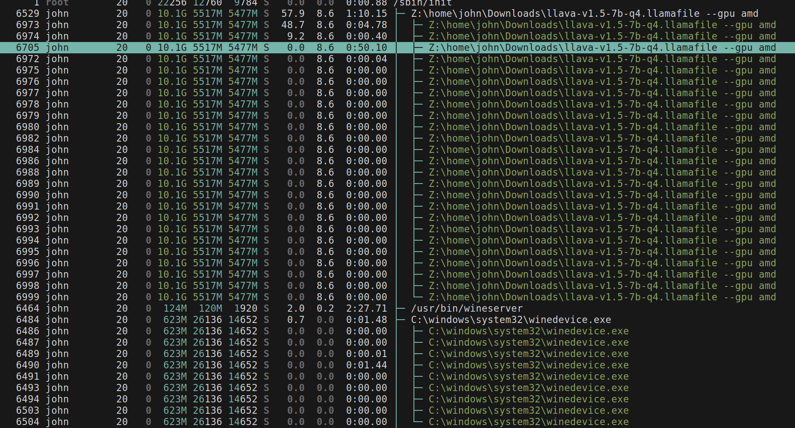
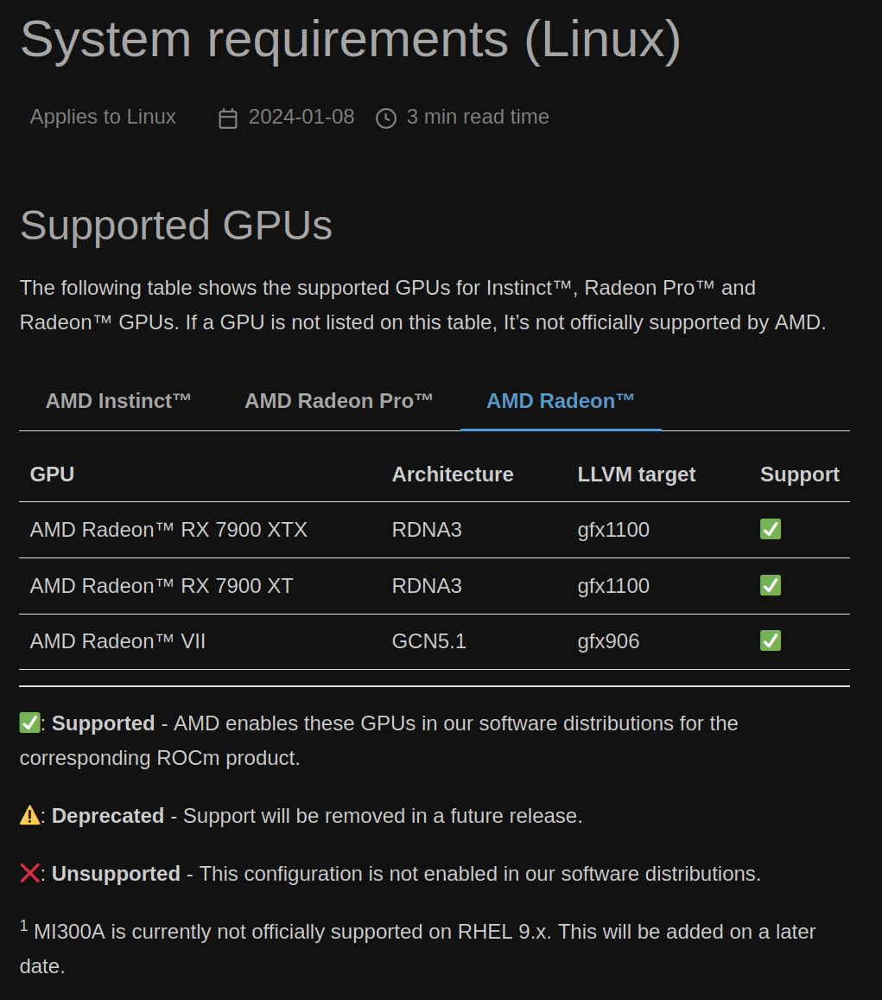

# Why this fork?

This fork of [llamafile](https://github.com/Mozilla-Ocho/llamafile) is for building llamafiles for memory cache.

There's no real reason yet to have forked the project, but I will be ready to contibute patches upstream if I come up with any.

# Memory Cache

[Memory Cache](https://github.com/Mozilla-Ocho/Memory-Cache) is a project that allows you to save a webpage while you're browsing in Firefox as a PDF, and save it to a synchronized folder that can be used in conjunction with privateGPT to augment a local language model.

My goal is to wrap the backend in a llamafile, and serve a browser front-end using llamafile's embedded http client.

# Dev Log

I am writing this dev log as I get things set up so that I don't forget what I've done or what I've learned. I've also added some files to the `log/` directory.

## Dependencies

> Developing on llamafile requires a modern version of the GNU `make` command

```sh
➜ make --version
GNU Make 4.4.1
Built for x86_64-pc-linux-gnu
Copyright (C) 1988-2023 Free Software Foundation, Inc.
License GPLv3+: GNU GPL version 3 or later <https://gnu.org/licenses/gpl.html>
This is free software: you are free to change and redistribute it.
There is NO WARRANTY, to the extent permitted by law.
```

> `sha256sum`

```sh
➜ sha256sum --version
sha256sum (GNU coreutils) 9.4
Copyright (C) 2023 Free Software Foundation, Inc.
License GPLv3+: GNU GPL version 3 or later <https://gnu.org/licenses/gpl.html>.
This is free software: you are free to change and redistribute it.
There is NO WARRANTY, to the extent permitted by law.

Written by Ulrich Drepper, Scott Miller, and David Madore.
```

> `wget`

```sh
➜ wget --version
GNU Wget 1.21.4 built on linux-gnu.

-cares +digest -gpgme +https +ipv6 +iri +large-file -metalink +nls
+ntlm +opie +psl +ssl/gnutls

Wgetrc:
    /etc/wgetrc (system)
Locale:
    /usr/share/locale
Compile:
    gcc -DHAVE_CONFIG_H -DSYSTEM_WGETRC="/etc/wgetrc"
    -DLOCALEDIR="/usr/share/locale" -I. -I../lib -I../lib
    -I/usr/include/p11-kit-1 -DHAVE_LIBGNUTLS -DNDEBUG -march=x86-64
    -mtune=generic -O2 -pipe -fno-plt -fexceptions
    -Wp,-D_FORTIFY_SOURCE=2 -Wformat -Werror=format-security
    -fstack-clash-protection -fcf-protection -g
    -ffile-prefix-map=/build/wget/src=/usr/src/debug/wget -flto=auto
Link:
    gcc -I/usr/include/p11-kit-1 -DHAVE_LIBGNUTLS -DNDEBUG
    -march=x86-64 -mtune=generic -O2 -pipe -fno-plt -fexceptions
    -Wp,-D_FORTIFY_SOURCE=2 -Wformat -Werror=format-security
    -fstack-clash-protection -fcf-protection -g
    -ffile-prefix-map=/build/wget/src=/usr/src/debug/wget -flto=auto
    -Wl,-O1,--sort-common,--as-needed,-z,relro,-z,now -flto=auto
    -lpcre2-8 -luuid -lidn2 -lnettle -lgnutls -lz -lpsl ../lib/libgnu.a
    /usr/lib/libunistring.so

Copyright (C) 2015 Free Software Foundation, Inc.
License GPLv3+: GNU GPL version 3 or later
<http://www.gnu.org/licenses/gpl.html>.
This is free software: you are free to change and redistribute it.
There is NO WARRANTY, to the extent permitted by law.

Originally written by Hrvoje Niksic <hniksic@xemacs.org>.
Please send bug reports and questions to <bug-wget@gnu.org>.
```

> `unzip`

```sh
➜ unzip --version
caution:  both -n and -o specified; ignoring -o
UnZip 6.00 of 20 April 2009, by Info-ZIP.  Maintained by C. Spieler.  Send
bug reports using http://www.info-zip.org/zip-bug.html; see README for details.

Usage: unzip [-Z] [-opts[modifiers]] file[.zip] [list] [-x xlist] [-d exdir]
  Default action is to extract files in list, except those in xlist, to exdir;
  file[.zip] may be a wildcard.  -Z => ZipInfo mode ("unzip -Z" for usage).

  -p  extract files to pipe, no messages     -l  list files (short format)
  -f  freshen existing files, create none    -t  test compressed archive data
  -u  update files, create if necessary      -z  display archive comment only
  -v  list verbosely/show version info       -T  timestamp archive to latest
  -x  exclude files that follow (in xlist)   -d  extract files into exdir
modifiers:
  -n  never overwrite existing files         -q  quiet mode (-qq => quieter)
  -o  overwrite files WITHOUT prompting      -a  auto-convert any text files
  -j  junk paths (do not make directories)   -aa treat ALL files as text
  -U  use escapes for all non-ASCII Unicode  -UU ignore any Unicode fields
  -C  match filenames case-insensitively     -L  make (some) names lowercase
  -X  restore UID/GID info                   -V  retain VMS version numbers
  -K  keep setuid/setgid/tacky permissions   -M  pipe through "more" pager
  -O CHARSET  specify a character encoding for DOS, Windows and OS/2 archives
  -I CHARSET  specify a character encoding for UNIX and other archives

See "unzip -hh" or unzip.txt for more help.  Examples:
  unzip data1 -x joe   => extract all files except joe from zipfile data1.zip
  unzip -p foo | more  => send contents of foo.zip via pipe into program more
  unzip -fo foo ReadMe => quietly replace existing ReadMe if archive file newer
```

## Building from source

> `make -j8`

To my surprise, this command started a wine prompt. Why? What is it doing?



The README.md mentions WINE in the gotchas section:

> On some Linux systems, you might get errors relating to `run-detectors`
> or WINE. This is due to `binfmt_misc` registrations. You can fix that by
> adding an additional registration for the APE file format llamafile
> uses:
>
> ```sh
> sudo wget -O /usr/bin/ape https://cosmo.zip/pub/cosmos/bin/ape-$(uname -m).elf
> sudo chmod +x /usr/bin/ape
> sudo sh -c "echo ':APE:M::MZqFpD::/usr/bin/ape:' >/proc/sys/fs/binfmt_misc/register"
> sudo sh -c "echo ':APE-jart:M::jartsr::/usr/bin/ape:' >/proc/sys/fs/binfmt_misc/register"
> ```

I didn't know about `binfmt_misc` before, so I learned about it:

> binfmt_misc is a flexible and powerful feature of the Linux kernel that allows the kernel to recognize and execute files with arbitrary binary formats. It stands for "binary format miscellaneous," and it's particularly useful for running executable files that are not native to the system's architecture or for which there isn't a direct execution mechanism available in the kernel. Here's more detail on its origins, usage, and management:
> Origin
>
>     binfmt_misc was introduced to extend the kernel's ability to handle different binary formats beyond the native formats it supports (like ELF for Linux).
>     It is part of the Linux kernel and has been available since around the 2.1.43 version (mid-1997), providing a way to add support for non-native executable formats.
>
> Interacting with binfmt_misc
>
>     binfmt_misc is typically mounted as a filesystem under /proc/sys/fs/binfmt_misc, allowing user-space interaction.
>     You interact with it by reading from or writing to special files in this directory.
>     Each registered binary format has a corresponding file in this directory.
>
> Inspecting binfmt_misc
>
>     To see which binary formats are currently registered, you can simply list the contents of /proc/sys/fs/binfmt_misc. For example, using ls /proc/sys/fs/binfmt_misc or cat /proc/sys/fs/binfmt_misc/status.
>     Each entry in this directory (other than status and register) represents a registered binary format.
>
> Modifying binfmt_misc
>
>     To register a new binary format, you write a configuration string to the register file in the /proc/sys/fs/binfmt_misc directory.
>     The configuration string typically includes a magic number (to identify the file type), mask, and the interpreter to use.
>     For example, the commands you mentioned in your query are registering a new format for handling APE files by specifying how these should be recognized and processed.
>     To unregister a format, you can write to the specific file corresponding to that format in the /proc/sys/fs/binfmt_misc directory.

I am on x86_64 hardware:

```sh
➜ uname -m
x86_64
```

So the suggested commands will download the `ape` executable from `cosmo.zip` and register it as the thing that the linux kernel uses as the interpreter for the binary file format.

Let's download and run this executable. What could go wrong?

```sh
➜ ape --help
NAME

  actually portable executable loader version 1.10
  copyrights 2024 justine alexandra roberts tunney
  https://justine.lol/ape.html

USAGE

  ape   PROG [ARGV1,ARGV2,...]
  ape - PROG [ARGV0,ARGV1,...]

```

```sh
➜ ls /proc/sys/fs/binfmt_misc
APE  APE-jart  DOSWin  register  status

➜ bat /proc/sys/fs/binfmt_misc/APE*
───────┬────────────────────────────────────────────────────────────────────────────────────────────────────────────────────────────────
       │ File: /proc/sys/fs/binfmt_misc/APE
───────┼────────────────────────────────────────────────────────────────────────────────────────────────────────────────────────────────
   1   │ enabled
   2   │ interpreter /usr/bin/ape
   3   │ flags:
   4   │ offset 0
   5   │ magic 4d5a71467044
───────┴────────────────────────────────────────────────────────────────────────────────────────────────────────────────────────────────
───────┬────────────────────────────────────────────────────────────────────────────────────────────────────────────────────────────────
       │ File: /proc/sys/fs/binfmt_misc/APE-jart
───────┼────────────────────────────────────────────────────────────────────────────────────────────────────────────────────────────────
   1   │ enabled
   2   │ interpreter /usr/bin/ape
   3   │ flags:
   4   │ offset 0
   5   │ magic 6a6172747372
───────┴────────────────────────────────────────────────────────────────────────────────────────────────────────────────────────────────
```

# ROCm

The `make -j8` command still fails for me. (I saved the output to a file in this directory: `build.log`).

It seems to be complaining about `nvcc` missing. But I don't think I should have `nvcc` installed, because I don't have an NVIDIA GPU. Maybe I need `ROCm` installed on my system.

The README mentions:

> AMD GPU owners need to install the ROCm SDK. If llamafile detects the presence of an SDK, then it'll compile a native module just for your system that uses either the cuBLAS or hipBLAS library.

On archlinux, it appears that there are some [repositories](https://github.com/rocm-arch/rocm-arch) set up for doing just that. So I'll just `pacman -S rocm-hip-sdk` and try again. I installed `rocm-hip-sdk`, rebooted (just in case) and tried again, to no avail (`build2.log`).

Perhaps it's best to take a step back and try to run an existing llamafile, rather than building from source.

While one is downloading, let's poke around at some of the recent commits related to AMD and try to figure out what causes `make` to build for NVIDIA or for AMD gpus (if it chooses one or the other at all).

- https://github.com/Mozilla-Ocho/llamafile/commit/67d97b520278232f88b852e8e6d61847ce0728b8

Ok, the download is finished. Let's run it. It works (`llamafile.log`).

Let's try again. Only this time, let's pass `--gpu amd` (`llamafile2.log`).

I wonder why `wineserver` is running. Is that related? I'll have to find out.



Ok, I found out. After I rebooted, the `binfmt_misc` registrations I added were removed, so wine was invoked for the llamafile binary format. Surprisingly, it seemed that everything worked, but it was extremely slow to start. When I added the correct registrations then the server started immediately.

Anyway, I can't tell if the GPU flag is being respected. If I put in `--gpu foo`, it should fail, right? Hmm. I tried, but apparently this does not cause it to fail. I need to figure out how to check whether this is successfully using my (AMD) GPU.

Well, I discovered `rocm-smi`, which is similar to `nvidia-smi`. I can `watch -n 2 rocm-smi` to see a GPU stats updated every two seconds. And I also discovered this "PROTIP", in the output of `llava-v1.5-7b-q4.llamafile --help`:

> PROTIP
>
> The -ngl 35 flag needs to be passed in order to use GPUs made by NVIDIA
> and AMD. It's not enabled by default since it sometimes needs to be
> tuned based on the system hardware and model architecture, in order to
> achieve optimal performance, and avoid compromising a shared display.

So, trying again:

```sh
➜ ~/Downloads/llava-v1.5-7b-q4.llamafile --gpu amd --nobrowser -ngl 35
initializing gpu module...
note: won't compile AMD GPU support because $HIP_PATH/bin/clang++ is missing
prebuilt binary /zip/ggml-rocm.so not found
fatal error: support for --gpu amd was explicitly requested, but it wasn't available
```

Nice! Now we're getting somewhere. I don't have the `$HIP_PATH` set to anything, and there's also not a `clang++` where my other `rocm` tools are:

```sh
➜ which clang++
/usr/bin/clang++

➜ clang++ --version
clang version 16.0.6
Target: x86_64-pc-linux-gnu
Thread model: posix
InstalledDir: /usr/bin

➜ ls /opt/rocm/bin/clang*
/opt/rocm/bin/clang-ocl

➜ ls /opt/rocm/bin/*cc
/opt/rocm/bin/hipcc
```

Let's try setting `$HIP_PATH` to `/opt/rocm`. No, same error.

I wonder what the difference between these three things are:

```sh
➜ /opt/rocm/bin/hipcc --version
HIP version: 5.7.31921-
clang version 17.0.0
Target: x86_64-pc-linux-gnu
Thread model: posix
InstalledDir: /opt/rocm/llvm/bin

➜ clang++ --version
clang version 16.0.6
Target: x86_64-pc-linux-gnu
Thread model: posix
InstalledDir: /usr/bin

➜ clang-ocl --version
clang version 17.0.0
Target: amdgcn-amd-amdhsa
Thread model: posix
InstalledDir: /opt/rocm/llvm/bin
/opt/rocm/llvm/bin/llvm-link: No such file or directory
clang version 17.0.0
Target: amdgcn-amd-amdhsa
Thread model: posix
InstalledDir: /opt/rocm/llvm/bin
```

Maybe `hipcc` is a version of `clang++`. Let's try creating a symlink:

```sh
➜ sudo ln -s /opt/rocm/bin/hipcc /opt/rocm/bin/clang++
```

Hmm, running with that symlink seems to have failed. (`llama2.log`)

What if I symlink my regular `clang++` install?

```sh
➜ sudo ln -s /usr/bin/clang++ /opt/rocm/bin/clang++
```

No, that's not right either. Ok. So there's supposed to be a `clang++` in my `HIP_PATH/bin` directory.

I think I figured out that `ggml-rocm.so` is built dynamically and stored in `~/.llamafile/`. If I mess up and create a bad version of this, I need to delete it or else future things will fail. But interestingly, symlinking `hipcc` or `clang++` will allow that step to succeed. When I inspect `llama2.log`, I see:

```
dynamically linking /home/john/.llamafile/ggml-rocm.so
```

Which means that it used `hipcc` or `/usr/bin/clang++` to compile or build. So either the symlink was correct and I'm onto a new issue, or the symlink was incorrect and leading to this error.

Let's inspect the log some more...

```
llava-v1.5-7b-q4.llamafile: /usr/src/debug/hip-runtime-amd/clr-rocm-5.7.1/rocclr/os/os_posix.cpp:310: static void amd::Os::currentStackInfo(unsigned char**, size_t*): Assertion `Os::currentStackPtr() >= *base - *size && Os::currentStackPtr() < *base && "just checking"' failed.
cosmoaddr2line /home/john/Downloads/llava-v1.5-7b-q4.llamafile 7ff98a93983c 7ff98a8a9010 7ff98a8a9010 7ff98a8a9010 7ff98a8a9010 7ff98a8a9010 7ff98a8a9010 7ff98a8a9010 7ff98a8a9010 7ff98a8a9010 7ff98a8a9010 7ff98a8a9010 7ff98a8a9010

...

0x00007ff98a8a9010: ?? ??:0

...

10008004-10008018 rw-pa-     21x automap 1344kB w/ 2052mB hole
1001005b-1001ffa4 r--s-- 65'354x automap 4085mB w/ 96tB hole
6fd00004-6fd0000b rw-paF      8x zipos 512kB w/ 64gB hole
6fe00004-6fe00004 rw-paF      1x g_fds 64kB
# 4087mB total mapped memory
/home/john/Downloads/llava-v1.5-7b-q4.llamafile -m llava-v1.5-7b-Q4_K.gguf --mmproj llava-v1.5-7b-mmproj-Q4_0.gguf --gpu amd --nobrowser -ngl 35
[1]    41074 IOT instruction (core dumped)  ~/Downloads/llava-v1.5-7b-q4.llamafile --gpu amd --nobrowser -ngl 35

```

Ok, so memory mapping seems to fail. Let's go back to building from source and see if it works with our symlink.

Actually, building just works now, even when `/opt/rocm/bin` is not on my `$PATH` and there's no `hipcc -> clang++` symlink. Is it because build artifacts were already created? If so, where? How do I get a "fresh start"?

Hmm. Alarming. I can't seem to recreate the original errors.

Well, let's try out the examples from the `## Source installation` section of the readme.

```sh
curl -L -o "~/media/aimodels/mistral-7b-instruct-v0.1.Q4_K_M.gguf" https://huggingface.co/TheBloke/Mistral-7B-Instruct-v0.1-GGUF/resolve/main/mistral-7b-instruct-v0.1.Q4_K_M.gguf
```

````sh
llamafile \
  --gpu AMD \
  -m ~/media/aimodels/wizardcoder-python-13b-v1.0.Q2_K.gguf \
  --temp 0 \
  -r '}\n' \
  -r '```\n' \
  -e -p '```c\nvoid *memcpy(void *dst, const void *src, size_t size) {\n'
````

More observations... `--gpu AMD` will fail if `/opt/rocm/bin` is not on my path.

````sh
➜ llamafile \
  --gpu AMD \
  -m ~/media/aimodels/wizardcoder-python-13b-v1.0.Q2_K.gguf \
  --temp 0 \
  -r '}\n' \
  -r '```\n' \
  -e -p '```c\nvoid *memcpy(void *dst, const void *src, size_t size) {\n'

import_cuda_impl: initializing gpu module...
get_rocm_bin_path: note: amdclang++ not found on $PATH
get_rocm_bin_path: note: $HIP_PATH/bin/amdclang++ does not exist
get_rocm_bin_path: note: /opt/rocm/bin/amdclang++ does not exist
get_rocm_bin_path: note: hipInfo not found on $PATH
get_rocm_bin_path: note: $HIP_PATH/bin/hipInfo does not exist
get_rocm_bin_path: note: /opt/rocm/bin/hipInfo does not exist
get_rocm_bin_path: note: rocminfo not found on $PATH
get_rocm_bin_path: note: $HIP_PATH/bin/rocminfo does not exist
llamafile_log_command: /opt/rocm/bin/rocminfo
llamafile_log_command: hipcc -O3 -fPIC -shared -DNDEBUG --offload-arch=gfx1030 -march=native -mtune=native -use_fast_math -DGGML_BUILD=1 -DGGML_SHARED=1 -Wno-return-type -Wno-unused-result -DGGML_USE_HIPBLAS -DGGML_CUDA_MMV_Y=1 -DGGML_MULTIPLATFORM -DGGML_CUDA_DMMV_X=32 -DIGNORE4 -DK_QUANTS_PER_ITERATION=2 -DGGML_CUDA_PEER_MAX_BATCH_SIZE=128 -DIGNORE -o /home/john/.llamafile/ggml-rocm.so.t0taxr /home/john/.llamafile/ggml-cuda.cu -lhipblas -lrocblas
hipcc: No such file or directory
extract_cuda_dso: note: prebuilt binary /zip/ggml-rocm.so not found
fatal error: support for --gpu amd was explicitly requested, but it wasn't available

````

When I do add the `rocm` binaries to my path, I get the same memory mapping errors as before:

```sh
➜ PATH=$PATH:/opt/rocm/bin
```

````sh
➜ llamafile \
  --gpu AMD \
  -m ~/media/aimodels/wizardcoder-python-13b-v1.0.Q2_K.gguf \
  --temp 0 \
  -r '}\n' \
  -r '```\n' \
  -e -p '```c\nvoid *memcpy(void *dst, const void *src, size_t size) {\n'

import_cuda_impl: initializing gpu module...
get_rocm_bin_path: note: amdclang++ not found on $PATH
get_rocm_bin_path: note: $HIP_PATH/bin/amdclang++ does not exist
get_rocm_bin_path: note: /opt/rocm/bin/amdclang++ does not exist
get_rocm_bin_path: note: hipInfo not found on $PATH
get_rocm_bin_path: note: $HIP_PATH/bin/hipInfo does not exist
get_rocm_bin_path: note: /opt/rocm/bin/hipInfo does not exist
llamafile_log_command: /opt/rocm/bin/rocminfo
llamafile_log_command: hipcc -O3 -fPIC -shared -DNDEBUG --offload-arch=gfx1030 -march=native -mtune=native -use_fast_math -DGGML_BUILD=1 -DGGML_SHARED=1 -Wno-return-type -Wno-unused-result -DGGML_USE_HIPBLAS -DGGML_CUDA_MMV_Y=1 -DGGML_MULTIPLATFORM -DGGML_CUDA_DMMV_X=32 -DIGNORE4 -DK_QUANTS_PER_ITERATION=2 -DGGML_CUDA_PEER_MAX_BATCH_SIZE=128 -DIGNORE -o /home/john/.llamafile/ggml-rocm.so.re6ny7 /home/john/.llamafile/ggml-cuda.cu -lhipblas -lrocblas
/home/john/.llamafile/ggml-cuda.cu:5712:24: warning: loop not unrolled: the optimizer was unable to perform the requested transformation; the transformation might be disabled or specified as part of an unsupported transformation ordering [-Wpass-failed=transform-warning]
static __global__ void soft_max_f32(const float * x, const float * y, float * dst, const int ncols_par, const int nrows_y, const float scale) {
                       ^
/home/john/.llamafile/ggml-cuda.cu:5712:24: warning: loop not unrolled: the optimizer was unable to perform the requested transformation; the transformation might be disabled or specified as part of an unsupported transformation ordering [-Wpass-failed=transform-warning]
/home/john/.llamafile/ggml-cuda.cu:5712:24: warning: loop not unrolled: the optimizer was unable to perform the requested transformation; the transformation might be disabled or specified as part of an unsupported transformation ordering [-Wpass-failed=transform-warning]
/home/john/.llamafile/ggml-cuda.cu:5712:24: warning: loop not unrolled: the optimizer was unable to perform the requested transformation; the transformation might be disabled or specified as part of an unsupported transformation ordering [-Wpass-failed=transform-warning]
/home/john/.llamafile/ggml-cuda.cu:5712:24: warning: loop not unrolled: the optimizer was unable to perform the requested transformation; the transformation might be disabled or specified as part of an unsupported transformation ordering [-Wpass-failed=transform-warning]
/home/john/.llamafile/ggml-cuda.cu:5712:24: warning: loop not unrolled: the optimizer was unable to perform the requested transformation; the transformation might be disabled or specified as part of an unsupported transformation ordering [-Wpass-failed=transform-warning]
6 warnings generated when compiling for gfx1030.
link_cuda_dso: note: dynamically linking /home/john/.llamafile/ggml-rocm.so
llamafile: /usr/src/debug/hip-runtime-amd/clr-rocm-5.7.1/rocclr/os/os_posix.cpp:310: static void amd::Os::currentStackInfo(unsigned char**, size_t*): Assertion `Os::currentStackPtr() >= *base - *size && Os::currentStackPtr() < *base && "just checking"' failed.
cosmoaddr2line /usr/local/bin/llamafile 7f204164e83c 7f20415be010 7f20415be010 7f20415be010 7f20415be010 7f20415be010 7f20415be010 7f20415be010 7f20415be010 7f20415be010 7f20415be010 7f20415be010 7f20415be010

0x00007f204164e83c: ?? ??:0
0x00007f20415be010: ?? ??:0
0x00007f20415be010: ?? ??:0
0x00007f20415be010: ?? ??:0
0x00007f20415be010: ?? ??:0
0x00007f20415be010: ?? ??:0
0x00007f20415be010: ?? ??:0
0x00007f20415be010: ?? ??:0
0x00007f20415be010: ?? ??:0
0x00007f20415be010: ?? ??:0
0x00007f20415be010: ?? ??:0
0x00007f20415be010: ?? ??:0
0x00007f20415be010: ?? ??:0
0x00007f20415be010: ?? ??:0
0x00007f20415be010: ?? ??:0
0x00007f20415be010: ?? ??:0
0x00007f20415be010: ?? ??:0
0x00007f20415be010: ?? ??:0
0x00007f20415be010: ?? ??:0
0x00007f20415be010: ?? ??:0
0x00007f20415be010: ?? ??:0
0x00007f20415be010: ?? ??:0
0x00007f20415be010: ?? ??:0
0x00007f20415be010: ?? ??:0
0x00007f20415be010: ?? ??:0
0x00007f20415be010: ?? ??:0
0x00007f20415be010: ?? ??:0
0x00007f20415be010: ?? ??:0
0x00007f20415be010: ?? ??:0
0x00007f20415be010: ?? ??:0
0x00007f20415be010: ?? ??:0
0x00007f20415be010: ?? ??:0
0x00007f20415be010: ?? ??:0
0x00007f20415be010: ?? ??:0
0x00007f20415be010: ?? ??:0
0x00007f20415be010: ?? ??:0
0x00007f20415be010: ?? ??:0
0x00007f20415be010: ?? ??:0
0x00007f20415be010: ?? ??:0
0x00007f20415be010: ?? ??:0
0x00007f20415be010: ?? ??:0
0x00007f20415be010: ?? ??:0
0x00007f20415be010: ?? ??:0
0x00007f20415be010: ?? ??:0
0x00007f20415be010: ?? ??:0
0x00007f20415be010: ?? ??:0
0x00007f20415be010: ?? ??:0
0x00007f20415be010: ?? ??:0
0x00007f20415be010: ?? ??:0
0x00007f20415be010: ?? ??:0
0x00007f20415be010: ?? ??:0
0x00007f20415be010: ?? ??:0
0x00007f20415be010: ?? ??:0
0x00007f20415be010: ?? ??:0
0x00007f20415be010: ?? ??:0
0x00007f20415be010: ?? ??:0
0x00007f20415be010: ?? ??:0
0x00007f20415be010: ?? ??:0
0x00007f20415be010: ?? ??:0
0x00007f20415be010: ?? ??:0
0x00007f20415be010: ?? ??:0
0x00007f20415be010: ?? ??:0
0x00007f20415be010: ?? ??:0
0x00007f20415be010: ?? ??:0
0x00007f20415be010: ?? ??:0
0x00007f20415be010: ?? ??:0
0x00007f20415be010: ?? ??:0
0x00007f20415be010: ?? ??:0
0x00007f20415be010: ?? ??:0
0x00007f20415be010: ?? ??:0
0x00007f20415be010: ?? ??:0
0x00007f20415be010: ?? ??:0
0x00007f20415be010: ?? ??:0
0x00007f20415be010: ?? ??:0
0x00007f20415be010: ?? ??:0
0x00007f20415be010: ?? ??:0
0x00007f20415be010: ?? ??:0
0x00007f20415be010: ?? ??:0
0x00007f20415be010: ?? ??:0
0x00007f20415be010: ?? ??:0
0x00007f20415be010: ?? ??:0
0x00007f20415be010: ?? ??:0
0x00007f20415be010: ?? ??:0
0x00007f20415be010: ?? ??:0
0x00007f20415be010: ?? ??:0
0x00007f20415be010: ?? ??:0
0x00007f20415be010: ?? ??:0
0x00007f20415be010: ?? ??:0
0x00007f20415be010: ?? ??:0
0x00007f20415be010: ?? ??:0
0x00007f20415be010: ?? ??:0
0x00007f20415be010: ?? ??:0
0x00007f20415be010: ?? ??:0
0x00007f20415be010: ?? ??:0
0x00007f20415be010: ?? ??:0
0x00007f20415be010: ?? ??:0
0x00007f20415be010: ?? ??:0
0x00007f20415be010: ?? ??:0
0x00007f20415be010: ?? ??:0
0x00007f20415be010: ?? ??:0
0x00007f20415be010: ?? ??:0
0x00007f20415be010: ?? ??:0
0x00007f20415be010: ?? ??:0
0x00007f20415be010: ?? ??:0
0x00007f20415be010: ?? ??:0
0x00007f20415be010: ?? ??:0
0x00007f20415be010: ?? ??:0
0x00007f20415be010: ?? ??:0
0x00007f20415be010: ?? ??:0
0x00007f20415be010: ?? ??:0
0x00007f20415be010: ?? ??:0
0x00007f20415be010: ?? ??:0
0x00007f20415be010: ?? ??:0
0x00007f20415be010: ?? ??:0
0x00007f20415be010: ?? ??:0
0x00007f20415be010: ?? ??:0
0x00007f20415be010: ?? ??:0
0x00007f20415be010: ?? ??:0
0x00007f20415be010: ?? ??:0
0x00007f20415be010: ?? ??:0
0x00007f20415be010: ?? ??:0
0x00007f20415be010: ?? ??:0
0x00007f20415be010: ?? ??:0

10008004-10008018 rw-pa- 21x automap 1344kB w/ 8384kB hole
1000809c-100080a3 r--s--  8x automap 451kB w/ 96tB hole
6fd00004-6fd0000c rw-paF  9x zipos 576kB w/ 64gB hole
6fe00004-6fe00004 rw-paF  1x g_fds 64kB
# 2496kB total mapped memory
/usr/local/bin/llamafile --gpu AMD -m /home/john/media/aimodels/wizardcoder-python-13b-v1.0.Q2_K.gguf --temp 0 -r }\n -r ```\n -e -p ```c\nvoid *memcpy(void *dst, const void *src, size_t size) {\n
[1]    76267 IOT instruction (core dumped)  llamafile --gpu AMD -m ~/media/aimodels/wizardcoder-python-13b-v1.0.Q2_K.gguf
````

Hmm, what's the next step to debug this?

````sh
llamafile \
  --gpu AMD \
  -m ~/media/aimodels/wizardcoder-python-13b-v1.0.Q2_K.gguf \
  --temp 0 \
  -r '}\n' \
  -r '```\n' \
  -e -p '```c\nvoid *memcpy(void *dst, const void *src, size_t size) {\n'
````

I've been looking through issues on github and trying things I find there, but none seem to be a fix for this specific issue. It works if I pass `--gpu cpu`, but fails with `--gpu amd`.

The output might mean that `cosmoaddr2line` is failing to resolve addresses.

> cosmoaddr2line
>
> The cosmoaddr2line program may be used to print backtraces, based on DWARF data, whenever one of your programs reports a crash. It accepts as an argument the ELF executable produced by cosmocc, which is different from the APE executable. For example, if cosmocc compiles a program named hello then you'll need to pass either hello.com.dbg (x86-64) or hello.aarch64.elf to cosmoaddr2line to get the backtrace. After the ELf executable comes the program counter (instruction pointer) addresses which are easily obtained using \_\_builtin_frame_address(0). Cosmo can make this easier in certain cases. The ShowCrashReports() feature may print the cosmoaddr2line command you'll need to run, to get a better backtrace. On Windows, the Cosmopolitan runtime will output the command to the --strace log whenever your program dies due to a fatal signal that's blocked or in the SIG_DFL disposition.

Perhaps it's time for me to write a github issue asking for support.

--

Actually, after looking around more, other projects seem to have issues with the same error:

```
/usr/src/debug/hip-runtime-amd/clr-rocm-5.7.1/rocclr/os/os_posix.cpp:310: static void amd::Os::currentStackInfo(unsigned char**, size_t*): Assertion `Os::currentStackPtr() >= *base - *size && Os::currentStackPtr() < *base && "just checking"' failed.
```

Maybe my graphics card is not supported by ROCm, even though I can install the tools on my machine and they (seem to) work:


